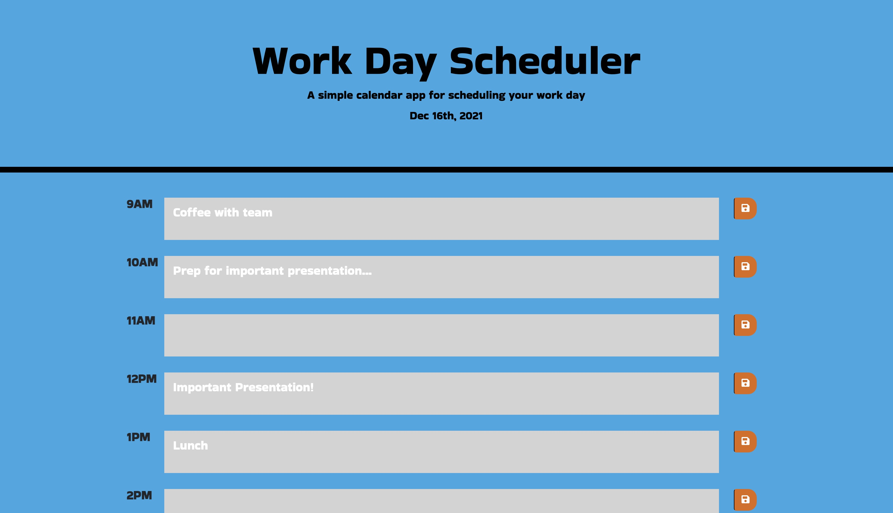

# Day-Planner

## Description

This project includes a modification and rework of starter code to create an application that allows for an individual to create schedule using a daily planner. The current date is displayed at the top of the page and as the hours go by, the timeblocks indicate whether the hour is in the past, present, or future. Enter your todos into the text areas, save your input with the save button in the far right column, and go through your day wth ease!

## Visuals

</img>

## Link

Link to Repository : https://github.com/giovannaruggio/day-planner

Link to Deployed Application : https://giovannaruggio.github.io/day-planner/